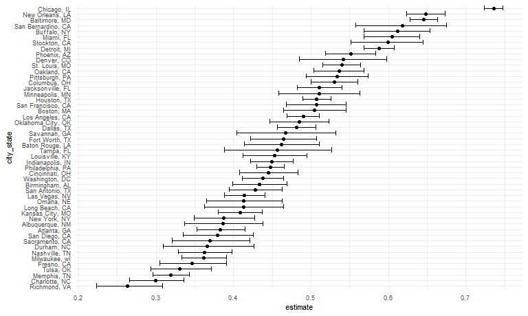
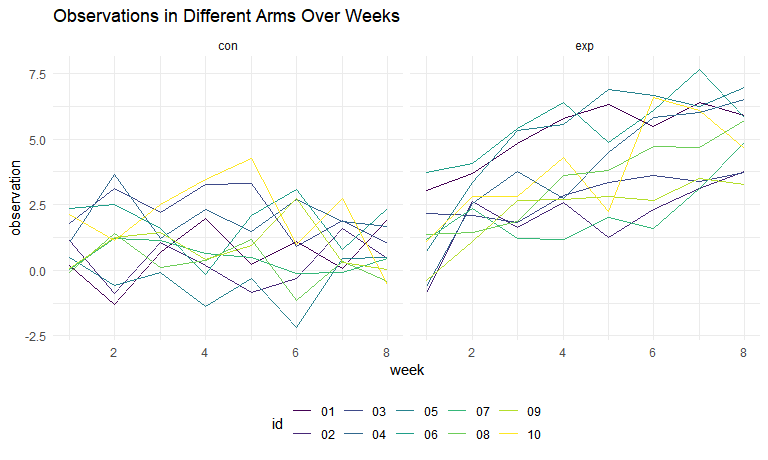
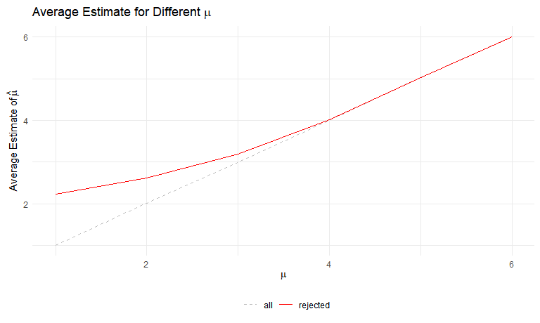

Homework 5
================
Shaolei Ma
2023-11-05

# Problem 1

First, import the data.

``` r
homicide_df =
  read_csv("data/homicide-data.csv")
```

    ## Rows: 52179 Columns: 12
    ## ── Column specification ────────────────────────────────────────────────────────
    ## Delimiter: ","
    ## chr (9): uid, victim_last, victim_first, victim_race, victim_age, victim_sex...
    ## dbl (3): reported_date, lat, lon
    ## 
    ## ℹ Use `spec()` to retrieve the full column specification for this data.
    ## ℹ Specify the column types or set `show_col_types = FALSE` to quiet this message.

The data contains 52179 observations and 12 variables related to the
victim’s biographical information and the location and disposition of
the case.

Then, do some data cleaning and analysis.

``` r
homicide_df = 
  homicide_df |> 
  janitor::clean_names() |> 
  mutate(city_state = str_c(city, ", ", state))

homicide_city_df = 
  homicide_df |> 
  group_by(city_state) |> 
  summarise(
    homicide_num = n(), 
    unsolved_num = sum(disposition == "Closed without arrest" | disposition == "Open/No arrest"))
```

Then, the total number of homicides is 52179, and the total number of
unsolved homicides is 26505.

For the city of Baltimore, MD:

``` r
baltimore_df =
  homicide_city_df |> 
  filter(city_state == "Baltimore, MD")

baltimore_prop = prop.test(pull(baltimore_df, unsolved_num), pull(baltimore_df, homicide_num))

baltimore_prop_df = 
  baltimore_prop |> 
  broom::tidy(baltimore_prop)
```

The estimated proportion of unsolved homicides is 0.646, and the
confidence interval is \[0.628, 0.663\].

``` r
prop_tidy = function(x, n) {
  
  result_df =
    prop.test(x, n) |> 
    broom::tidy()
  
  tibble(
    estimate = pull(result_df, estimate),
    conf.low = pull(result_df, conf.low),
    conf.high = pull(result_df, conf.high)
  )
  
}

unsolved_prop_df = 
  homicide_city_df |> 
  mutate(prop_estimate = map2(unsolved_num, homicide_num, prop_tidy)) |> 
  unnest(prop_estimate)
```

    ## Warning: There was 1 warning in `mutate()`.
    ## ℹ In argument: `prop_estimate = map2(unsolved_num, homicide_num, prop_tidy)`.
    ## Caused by warning in `prop.test()`:
    ## ! Chi-squared approximation may be incorrect

``` r
unsolved_prop_df |> 
  head() |> 
  knitr::kable(digits = 3)
```

| city_state      | homicide_num | unsolved_num | estimate | conf.low | conf.high |
|:----------------|-------------:|-------------:|---------:|---------:|----------:|
| Albuquerque, NM |          378 |          146 |    0.386 |    0.337 |     0.438 |
| Atlanta, GA     |          973 |          373 |    0.383 |    0.353 |     0.415 |
| Baltimore, MD   |         2827 |         1825 |    0.646 |    0.628 |     0.663 |
| Baton Rouge, LA |          424 |          196 |    0.462 |    0.414 |     0.511 |
| Birmingham, AL  |          800 |          347 |    0.434 |    0.399 |     0.469 |
| Boston, MA      |          614 |          310 |    0.505 |    0.465 |     0.545 |

The `unsolved_prop_df` dataframe collects the proportion estimate and CI
for each city.

``` r
unsolved_prop_df |> 
  mutate(city_state = fct_reorder(city_state, estimate)) |> 
  ggplot(aes(x = city_state, y = estimate)) +
  geom_point() +
  geom_errorbar(aes(ymin = conf.low, ymax = conf.high)) +
  theme(axis.text.x = element_text(angle = 90, hjust = 1)) # rotate labels
```



As illustrated in the plot, Tulsa has the lowest estimate and the widest
confidence interval, while Chicago has the highest estimate and the most
narrow confidence interval.

# Problem 2

``` r
import_data = function(url_path = "data/problem2_data/", name) {
  
  read_csv(str_c(url_path, name))
  
}

participants_df =
  tibble(names = list.files("data/problem2_data/")) |> # start with file names
  mutate(dat = map(names, import_data, url_path = "data/problem2_data/")) |> # read in data
  unnest(dat) |> 
  mutate(names = str_remove(names, ".csv")) |> #delete suffix
  separate(names, into = c("arm", "id"), sep = "_") |> 
  pivot_longer(
    week_1:week_8,
    names_to = "week",
    values_to = "observation",
    names_prefix = "week_",
    names_transform = list(week = as.numeric)
  )
```

    ## Rows: 1 Columns: 8
    ## ── Column specification ────────────────────────────────────────────────────────
    ## Delimiter: ","
    ## dbl (8): week_1, week_2, week_3, week_4, week_5, week_6, week_7, week_8
    ## 
    ## ℹ Use `spec()` to retrieve the full column specification for this data.
    ## ℹ Specify the column types or set `show_col_types = FALSE` to quiet this message.
    ## Rows: 1 Columns: 8
    ## ── Column specification ────────────────────────────────────────────────────────
    ## Delimiter: ","
    ## dbl (8): week_1, week_2, week_3, week_4, week_5, week_6, week_7, week_8
    ## 
    ## ℹ Use `spec()` to retrieve the full column specification for this data.
    ## ℹ Specify the column types or set `show_col_types = FALSE` to quiet this message.
    ## Rows: 1 Columns: 8
    ## ── Column specification ────────────────────────────────────────────────────────
    ## Delimiter: ","
    ## dbl (8): week_1, week_2, week_3, week_4, week_5, week_6, week_7, week_8
    ## 
    ## ℹ Use `spec()` to retrieve the full column specification for this data.
    ## ℹ Specify the column types or set `show_col_types = FALSE` to quiet this message.
    ## Rows: 1 Columns: 8
    ## ── Column specification ────────────────────────────────────────────────────────
    ## Delimiter: ","
    ## dbl (8): week_1, week_2, week_3, week_4, week_5, week_6, week_7, week_8
    ## 
    ## ℹ Use `spec()` to retrieve the full column specification for this data.
    ## ℹ Specify the column types or set `show_col_types = FALSE` to quiet this message.
    ## Rows: 1 Columns: 8
    ## ── Column specification ────────────────────────────────────────────────────────
    ## Delimiter: ","
    ## dbl (8): week_1, week_2, week_3, week_4, week_5, week_6, week_7, week_8
    ## 
    ## ℹ Use `spec()` to retrieve the full column specification for this data.
    ## ℹ Specify the column types or set `show_col_types = FALSE` to quiet this message.
    ## Rows: 1 Columns: 8
    ## ── Column specification ────────────────────────────────────────────────────────
    ## Delimiter: ","
    ## dbl (8): week_1, week_2, week_3, week_4, week_5, week_6, week_7, week_8
    ## 
    ## ℹ Use `spec()` to retrieve the full column specification for this data.
    ## ℹ Specify the column types or set `show_col_types = FALSE` to quiet this message.
    ## Rows: 1 Columns: 8
    ## ── Column specification ────────────────────────────────────────────────────────
    ## Delimiter: ","
    ## dbl (8): week_1, week_2, week_3, week_4, week_5, week_6, week_7, week_8
    ## 
    ## ℹ Use `spec()` to retrieve the full column specification for this data.
    ## ℹ Specify the column types or set `show_col_types = FALSE` to quiet this message.
    ## Rows: 1 Columns: 8
    ## ── Column specification ────────────────────────────────────────────────────────
    ## Delimiter: ","
    ## dbl (8): week_1, week_2, week_3, week_4, week_5, week_6, week_7, week_8
    ## 
    ## ℹ Use `spec()` to retrieve the full column specification for this data.
    ## ℹ Specify the column types or set `show_col_types = FALSE` to quiet this message.
    ## Rows: 1 Columns: 8
    ## ── Column specification ────────────────────────────────────────────────────────
    ## Delimiter: ","
    ## dbl (8): week_1, week_2, week_3, week_4, week_5, week_6, week_7, week_8
    ## 
    ## ℹ Use `spec()` to retrieve the full column specification for this data.
    ## ℹ Specify the column types or set `show_col_types = FALSE` to quiet this message.
    ## Rows: 1 Columns: 8
    ## ── Column specification ────────────────────────────────────────────────────────
    ## Delimiter: ","
    ## dbl (8): week_1, week_2, week_3, week_4, week_5, week_6, week_7, week_8
    ## 
    ## ℹ Use `spec()` to retrieve the full column specification for this data.
    ## ℹ Specify the column types or set `show_col_types = FALSE` to quiet this message.
    ## Rows: 1 Columns: 8
    ## ── Column specification ────────────────────────────────────────────────────────
    ## Delimiter: ","
    ## dbl (8): week_1, week_2, week_3, week_4, week_5, week_6, week_7, week_8
    ## 
    ## ℹ Use `spec()` to retrieve the full column specification for this data.
    ## ℹ Specify the column types or set `show_col_types = FALSE` to quiet this message.
    ## Rows: 1 Columns: 8
    ## ── Column specification ────────────────────────────────────────────────────────
    ## Delimiter: ","
    ## dbl (8): week_1, week_2, week_3, week_4, week_5, week_6, week_7, week_8
    ## 
    ## ℹ Use `spec()` to retrieve the full column specification for this data.
    ## ℹ Specify the column types or set `show_col_types = FALSE` to quiet this message.
    ## Rows: 1 Columns: 8
    ## ── Column specification ────────────────────────────────────────────────────────
    ## Delimiter: ","
    ## dbl (8): week_1, week_2, week_3, week_4, week_5, week_6, week_7, week_8
    ## 
    ## ℹ Use `spec()` to retrieve the full column specification for this data.
    ## ℹ Specify the column types or set `show_col_types = FALSE` to quiet this message.
    ## Rows: 1 Columns: 8
    ## ── Column specification ────────────────────────────────────────────────────────
    ## Delimiter: ","
    ## dbl (8): week_1, week_2, week_3, week_4, week_5, week_6, week_7, week_8
    ## 
    ## ℹ Use `spec()` to retrieve the full column specification for this data.
    ## ℹ Specify the column types or set `show_col_types = FALSE` to quiet this message.
    ## Rows: 1 Columns: 8
    ## ── Column specification ────────────────────────────────────────────────────────
    ## Delimiter: ","
    ## dbl (8): week_1, week_2, week_3, week_4, week_5, week_6, week_7, week_8
    ## 
    ## ℹ Use `spec()` to retrieve the full column specification for this data.
    ## ℹ Specify the column types or set `show_col_types = FALSE` to quiet this message.
    ## Rows: 1 Columns: 8
    ## ── Column specification ────────────────────────────────────────────────────────
    ## Delimiter: ","
    ## dbl (8): week_1, week_2, week_3, week_4, week_5, week_6, week_7, week_8
    ## 
    ## ℹ Use `spec()` to retrieve the full column specification for this data.
    ## ℹ Specify the column types or set `show_col_types = FALSE` to quiet this message.
    ## Rows: 1 Columns: 8
    ## ── Column specification ────────────────────────────────────────────────────────
    ## Delimiter: ","
    ## dbl (8): week_1, week_2, week_3, week_4, week_5, week_6, week_7, week_8
    ## 
    ## ℹ Use `spec()` to retrieve the full column specification for this data.
    ## ℹ Specify the column types or set `show_col_types = FALSE` to quiet this message.
    ## Rows: 1 Columns: 8
    ## ── Column specification ────────────────────────────────────────────────────────
    ## Delimiter: ","
    ## dbl (8): week_1, week_2, week_3, week_4, week_5, week_6, week_7, week_8
    ## 
    ## ℹ Use `spec()` to retrieve the full column specification for this data.
    ## ℹ Specify the column types or set `show_col_types = FALSE` to quiet this message.
    ## Rows: 1 Columns: 8
    ## ── Column specification ────────────────────────────────────────────────────────
    ## Delimiter: ","
    ## dbl (8): week_1, week_2, week_3, week_4, week_5, week_6, week_7, week_8
    ## 
    ## ℹ Use `spec()` to retrieve the full column specification for this data.
    ## ℹ Specify the column types or set `show_col_types = FALSE` to quiet this message.
    ## Rows: 1 Columns: 8
    ## ── Column specification ────────────────────────────────────────────────────────
    ## Delimiter: ","
    ## dbl (8): week_1, week_2, week_3, week_4, week_5, week_6, week_7, week_8
    ## 
    ## ℹ Use `spec()` to retrieve the full column specification for this data.
    ## ℹ Specify the column types or set `show_col_types = FALSE` to quiet this message.

``` r
participants_df |> 
  ggplot(aes(x = week, y = observation, group = id, color = id)) +
  geom_line() +
  facet_grid(. ~ arm)
```



From the spaghetti plot, the observation values of the experimental arm
increase over time, while those of the control arm fluctuates within a
certain range.

# Problem 3

For $\mu=0$:

``` r
t_test_tidy =
  function(n, mu, sigma) {
    
      rnorm(n, mu, sigma) |> 
      t.test() |> 
      broom::tidy() |> 
      select(estimate, p.value)
    
  }

sim_results_df =
  expand_grid(
    mu = 0,
    iter = 1:5000
  ) |> 
  mutate(test_result = map(mu, t_test_tidy, n = 30, sigma = 5)) |> 
  unnest(test_result)

sim_results_df |>
  head() |> 
  knitr::kable(digits = 3)
```

|  mu | iter | estimate | p.value |
|----:|-----:|---------:|--------:|
|   0 |    1 |    0.538 |   0.431 |
|   0 |    2 |    1.034 |   0.224 |
|   0 |    3 |   -0.497 |   0.675 |
|   0 |    4 |   -0.709 |   0.583 |
|   0 |    5 |   -0.021 |   0.980 |
|   0 |    6 |   -1.004 |   0.388 |

For $\mu={1,2,3,4,5,6}$:

``` r
sim2_results_df = 
  expand_grid(
    mu = c(1:6),
    iter = 1:5000
  ) |> 
  mutate(test_result = map(mu, t_test_tidy, n = 30, sigma = 5)) |> 
  unnest(test_result)

sim2_results_df |> 
  group_by(mu) |> 
  summarise(power = sum(p.value < 0.05) / n()) |> 
  ggplot(aes(x = mu, y = power)) + 
  geom_line()
```


``` r
sim2_results_df |> 
  group_by(mu) |> 
  summarise(mean_estimate = mean(estimate)) |> 
  ggplot(aes(x = mu, y = mean_estimate)) +
  geom_line(aes(color = "black")) +
  geom_line(data = 
              sim2_results_df |>
              filter(p.value < 0.05) |> 
              group_by(mu) |> 
              summarise(mean_estimate = mean(estimate)),
            aes(color = "red")) +
  scale_color_manual(name = "", 
                     values = c("black" = "black", "red" = "red"), 
                     labels = c('all','rejected'))
```


